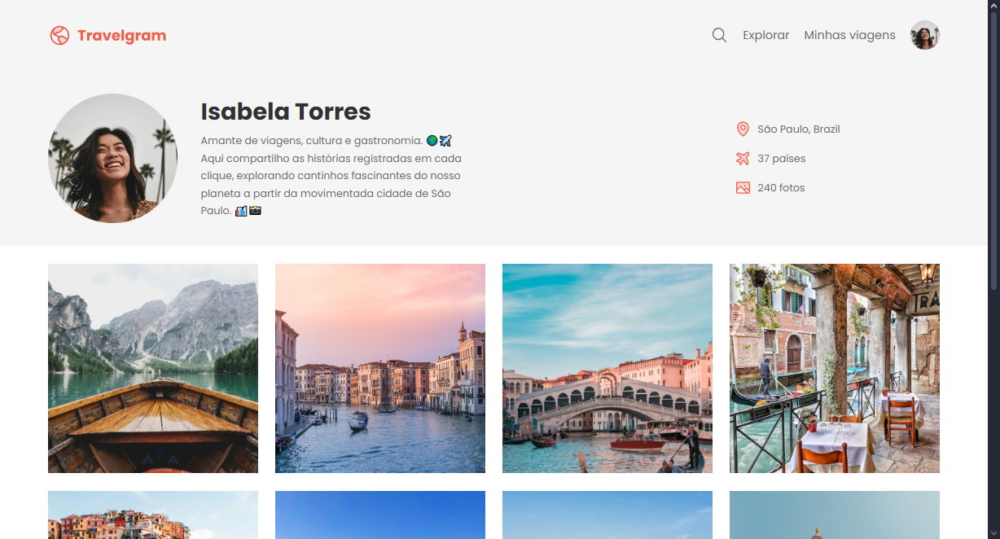

# Single page Travelgram 🌍✈️  

O **Travelgram** é um portal de viagens para explorar e compartilhar experiências ao redor do mundo.

Durante o desenvolvimento desta single page, aprofundei meus conhecimentos em HTML e CSS, explorando conceitos como variáveis CSS, Flexbox (`display: flex` e `justify-content`), além da estruturação de páginas web.  

## 🚀 Tecnologias utilizadas  
- **HTML5**  
- **CSS3**  
- **Flexbox**  
- **Uso de Variáveis CSS**  

## 🎯 Aprendizados  
- Aplicação de variáveis no CSS para facilitar a manutenção do código.  
- Posicionamento avançado com Flexbox.  
- Melhor compreensão do alinhamento de elementos (`justify-content`, `align-items`).  

## 📸 Preview  
  

